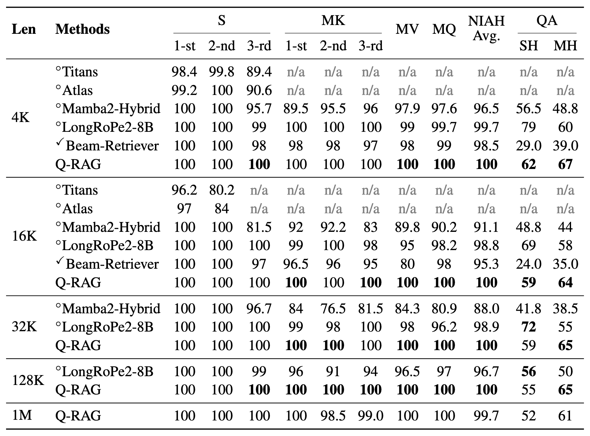
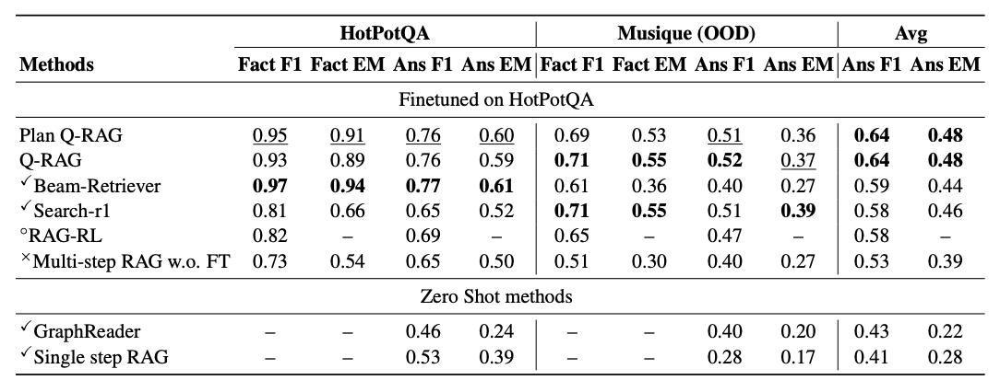
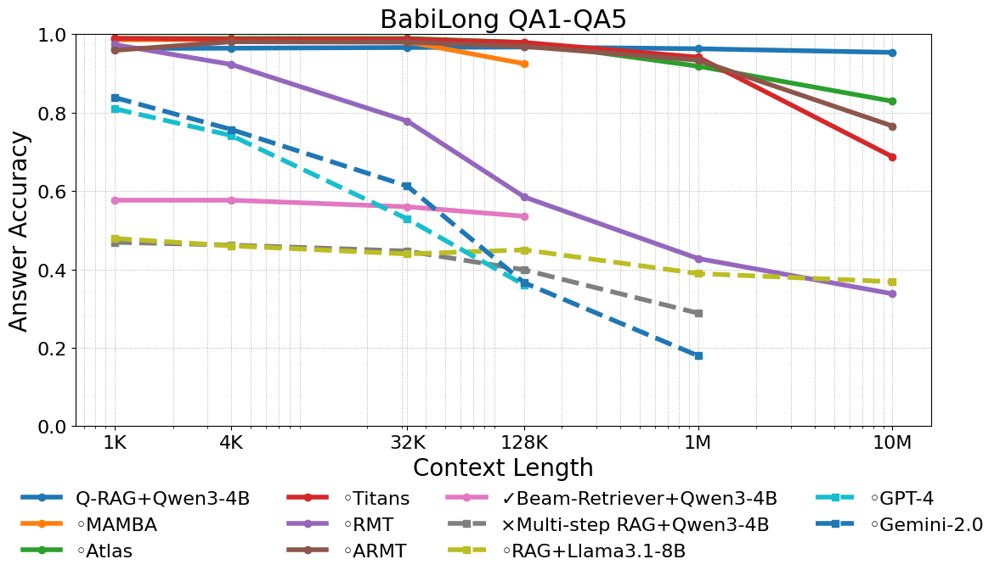
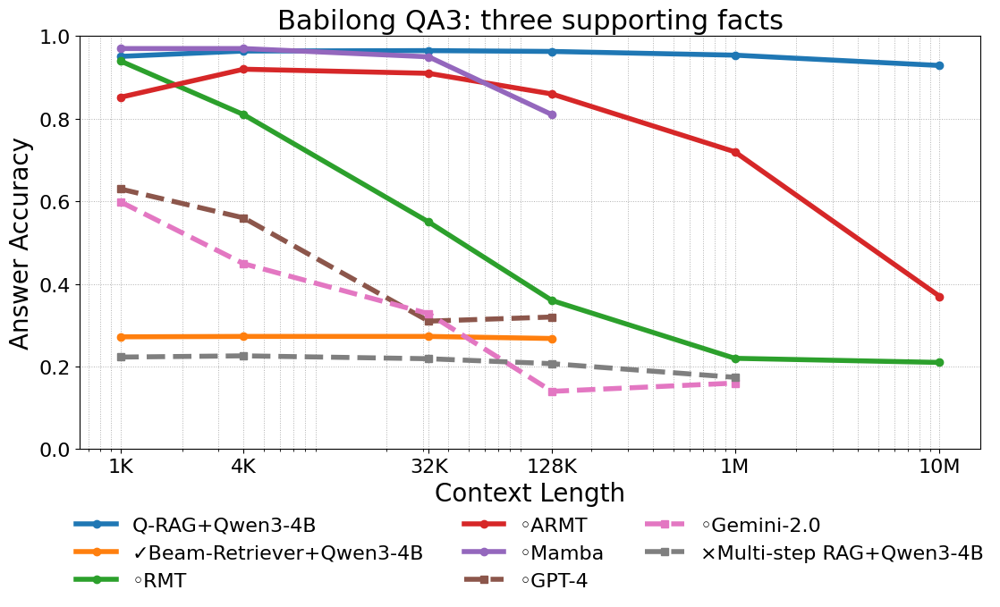

<div align="center">

# Q-RAG: Long Context Multi‑Step Retrieval via Value‑Based Embedder Training

**🏆 Accepted at ICLR 2026 (Oral)**

[](https://openreview.net/forum?id=MS9nWFY7LG)
[](https://arxiv.org/abs/2511.07328)
[](https://python.org)
[](https://creativecommons.org/licenses/by/4.0/)

</div>

<div align="center">

### ⚠️ Note: This codebase is currently under active debugging and refactoring. 

</div>

**Q-RAG** is a resource-efficient method for **multi-step retrieval** trained with reinforcement learning directly in the latent space of text-chunk embeddings. Instead of expensive LLM fine-tuning, Q-RAG trains only a lightweight embedder agent using value-based RL (temporal difference learning), keeping the LLM frozen. This repository provides the full training and evaluation code to reproduce the results from the paper.

Q-RAG achieves **state-of-the-art results** on long-context benchmarks (**BabiLong**, **RULER**) for contexts up to **10M tokens** and competitive performance on open-domain multi-hop QA (**HotpotQA**, **Musique**) — all trained on a **single A100 GPU**.
 

---

## 🔗 Links

| Resource | Link |
|----------|------|
| 📄 Paper (ICLR 2026) | [OpenReview](https://openreview.net/forum?id=MS9nWFY7LG) |
| 📝 arXiv preprint | [arxiv.org/abs/2511.07328](https://arxiv.org/abs/2511.07328) |
| 📑 PDF | [arxiv.org/pdf/2511.07328](https://arxiv.org/pdf/2511.07328) |
| 💾 Data | [Google Drive](https://drive.google.com/drive/folders/1UUIx-6vEBF9Mij81iVgPul86aXhdyxhG) |

---

### Results
#### RULER benchmark (Table 1)
Q-RAG achieves near-perfect retrieval on all NIAH subtasks, trained on 4K-length documents and generalizing up to 1M tokens:

<p align="center">
  
</p>

#### Open-domain QA (Table 2)
Results on HotpotQA (in-domain) and Musique (out-of-distribution). QwQ-32B was used as the reader LLM for Q-RAG and Beam Retriever:

<p align="center">
  
</p>

#### BabiLong benchmark
Q-RAG achieves the highest average performance across 5 tasks (QA1–QA5) at context lengths from 1M to 10M tokens, outperforming Titans, Atlas, ARMT, RMT, and proprietary LLMs. On the hardest subtask **QA3** (3-hop temporal reasoning), Q-RAG shows virtually **no degradation** as context grows to 10M tokens, while all baselines degrade significantly.

<p align="center">
  
  
</p>

> **Reproducibility note:** Results may vary slightly across seeds. All training was performed on a single A100-80GB GPU within 12 hours per model.

---

## 🛠 Installation

### Requirements

- Python 3.12
- CUDA-compatible GPU (80 GB A100 recommended for full reproduction)
- Linux recommended (tested on Ubuntu with CUDA)

### Setup

```bash
# Create conda environment
conda create -n qrag python=3.12 -y
conda activate qrag

# Install dependencies
python -m pip install -U pip wheel
pip install vllm  # pulls compatible PyTorch, Transformers, Triton, etc.
pip install hydra-core tensorboard rotary-embedding-torch pandas nltk sortedcontainers accelerate datasets
```

### Smoke test

```bash
python -c "from rl.agents.pqn import PQNActor; print('✅ Q-RAG installed successfully')"
```

---

## 🔬 Reproducibility

> **General notes:**
> - Training is launched via `train_q_rag.py`. All hyperparameters are managed by [Hydra](https://hydra.cc/) configs in `configs/`.
> - Download datasets from [Google Drive](https://drive.google.com/drive/folders/1UUIx-6vEBF9Mij81iVgPul86aXhdyxhG). Default paths are set in `configs/envs/`. Dataset paths use relative paths (e.g., `../datasets/...`), so the `datasets/` folder must be placed **next to** the `Q-RAG` repository directory:
>   ```
>   parent_dir/
>   ├── Q-RAG/      ← this repository
>   └── datasets/   ← downloaded datasets go here
>   ```
> - Results may vary slightly across seeds. All training was performed on a single A100-80GB GPU within 12 hours per model.
> - **Config priority:** `CLI args` > `configs/testing.yaml` > `pretrained_path/config.yaml`


**Models per benchmark:**
- BabiLong & RULER → `facebook/contriever`
- HotpotQA & Musique → `intfloat/multilingual-e5-large` and `Alibaba-NLP/gte-multilingual-base`

---

### 1. OpenQA Benchmarks (HotpotQA / Musique)

#### Data Preparation

Download HotpotQA and Musique datasets from [Google Drive](https://drive.google.com/drive/folders/1UUIx-6vEBF9Mij81iVgPul86aXhdyxhG) and place them so that the environment configs can find them. Default paths are set in `configs/envs/hotpotqa.yaml`, `configs/envs/musique.yaml`, and `configs/envs/hotpotqa+musique.yaml`.

#### Training

**HotpotQA only:**

```bash
python train_q_rag.py \
  envs=hotpotqa \
  max_action_length=220 \
  envs.max_steps=2 \
  batch_size=16 \
  accumulate_grads=2 \
  eval_episodes=100
```

**HotpotQA + Musique (combined, GTE embedder):**

```bash
python train_q_rag.py \
algo=pqn_gte \
envs=hotpotqa+musique \
eval_interval=100 \
eval_episodes=200 \
max_action_length=512 \
max_action_length_in_memory=256 \
batch_size=16 \
accumulate_grads=2 \
feedback.ground_truth.penalize_extra_steps=True \
feedback.never_terminate=True \
envs_parallel=1 \
envs.max_steps=6
```

> **Note:** `max_action_length` and `max_action_length_in_memory` may need adjustment depending on the dataset, GPU memory, and the model’s context window.

#### Evaluation

**Retriever evaluation:**

`eval_retriever.py` evaluates a pretrained retriever checkpoint and writes logs to the model's folder as `eval_seed{seed}_ns{num_sentences}.jsonl`.

```bash
python eval_retriever.py \
  pretrained_path=runs/<run_name> \
  num_samples=-1 \
  envs.max_steps=2
```

**LLM evaluation:**

```bash
CUDA_VISIBLE_DEVICES=0 python eval_llm.py \
  retriever_logdir/retriever_logs.jsonl \
  --llm_name "Qwen/Qwen3-4B"
```

---

### 2. BabiLong

#### Data Preparation

Download BabiLong data from [Google Drive](https://drive.google.com/drive/folders/1UUIx-6vEBF9Mij81iVgPul86aXhdyxhG). Default paths are set in `configs/envs/babilong.yaml`.

**Chunking pipeline:** In BabiLong, **each chunk is a single sentence** (not a fixed-size text block). The pipeline works as follows:

1. **`TaskDataset`** parses bAbI task files → extracts `facts` (sentence-level), `question`, `answer`, and `references_idx` (indices of supporting facts).
2. **`RetrSentenceSampler`** samples random sentences from PG19 books as **noise**.
3. **`RetrievalBabiLong`** assembles the final chunk list:
   - `num_noise = num_chunks − num_facts`
   - `shuffle(noise, facts)` — inserts facts at random positions among noise, **preserving the relative order of facts**.
4. **`QADatasetAdapter`** passes the pre-built `sample['chunks']` directly (no additional splitting).

The total number of chunks is controlled by the `num_chunks` / `num_sentences` parameter. The agent's task is to find the supporting facts among all chunks.

#### Training

```bash
# Example: QA2 task, 100 sentences, single GPU with 16 GB
python train_q_rag.py \
  envs.task=qa2_two-supporting-facts \
  envs.num_sentences=100 \
  batch_size=16 \
  accumulate_grads=3
```

**Training with optimal Q-value early stopping (q_value = 0.5):**

```bash
CUDA_VISIBLE_DEVICES=0 python train_q_rag.py \
  eval_interval=500 \
  eval_episodes=1000 \
  batch_size=64 \
  accumulate_grads=1 \
  max_action_length=64 \
  max_action_length_in_memory=64 \
  feedback.ground_truth.penalize_extra_steps=True \
  feedback.never_terminate=True \
  envs_parallel=1 \
  logger.log_dir=runs/q_value_early_stop \
  envs.task="qa3_three-supporting-facts"
```

#### Evaluation

**Retriever evaluation (single context length):**

```bash
python eval_retriever.py \
  pretrained_path=runs/<run_name> \
  envs.num_sentences=1200 \
  num_samples=200
```

**Multi-length BabiLong sweep** (1K → 1M tokens):

```bash
./scripts/eval_retriever_babilong.sh runs/<run_name> 0 42
```

**Retriever evaluation with Q-value collection:**

```bash
CUDA_VISIBLE_DEVICES=0 python eval_retriever.py \
    pretrained_path="PRETRAINED_PATH" \
    envs.num_sentences=1200 \
    num_samples=-1 \
    seed=42
```

> Sentence-to-token mapping: `50→1k, 160→4k, 1200→32k, 4600→128k, 40000→1M`

**LLM evaluation:**

```bash
# Single log file
CUDA_VISIBLE_DEVICES=0 python eval_llm.py \
  retriever_logdir/retriever_logs.jsonl \
  --llm_name "Qwen/Qwen3-4B" \
  --babi_task qa4

# Multi-length sweep
./scripts/eval_llm_babilong.sh path/to/retriever_logdir "Qwen/Qwen3-4B" "qa4" 0
```

**LLM evaluation with optimal Q-value filtering (0.5):**

```bash
CUDA_VISIBLE_DEVICES=0 python eval_llm.py \
  retriever_logdir/retriever_logs.jsonl \
  --llm_name "Qwen/Qwen3-4B" \
  --babi_task qa5 \
  --chunk_filter qvalue \
  --stopping_threshold 0.5
```

---

### 3. RULER

#### Data Preparation

Download RULER (NIAH) data from [Google Drive](https://drive.google.com/drive/folders/1UUIx-6vEBF9Mij81iVgPul86aXhdyxhG). Default paths are set in `configs/envs/niah.yaml`.

#### Training

```bash

```

#### Evaluation

**Retriever evaluation:**

```bash

```

**LLM evaluation:**

```bash

```

---

## 📂 Repository Structure

```
Q-RAG/
├── train_q_rag.py              # Main training script
├── eval_retriever.py           # Retriever evaluation
├── eval_llm.py                 # End-to-end LLM evaluation (BabiLong)
├── eval_llm_longbench.py       # LLM evaluation on LongBench
├── eval_sbor_q.py              # Q-value evaluation
├── eval_feedback.py            # Feedback model evaluation
├── llm-answering-vllm.py       # LLM answering via vLLM
│
├── configs/                    # Hydra configs
│   ├── training.yaml           # Main training config
│   ├── testing.yaml            # Evaluation config overrides
│   ├── algo/                   # Algorithm configs (pqn, pqn_gte, …)
│   ├── envs/                   # Environment configs (babilong, hotpotqa, combined, …)
│   ├── feedback/               # Feedback model configs
│   └── logger/                 # Logging configs
│
├── rl/                         # Core RL module
│   ├── agents/                 # Agent implementations (PQN, DQN, SAC-D, SARSA)
│   ├── feedback/               # Feedback / reward models
│   ├── q_module.py             # Q-function neural network
│   ├── optim.py                # Optimizer utilities
│   └── langchain_utils.py      # LangChain integration utilities
│
├── envs/                       # Environments
│   ├── text_env.py             # Text retrieval environment
│   ├── parallel_env.py         # Parallelized environment wrapper
│   ├── qa_env.py               # QA environment
│   ├── dataloaders/            # Dataset loaders (BabiLong, HotpotQA, Musique, …)
│   └── utils.py                # Environment utilities
│
├── prompts_and_metrics/        # Prompts and evaluation metrics
│   ├── babilong.py             # BabiLong prompts & metrics
│   ├── general_qa.py           # General QA metrics
│   ├── chunk_filtering.py      # Chunk filtering logic
│   └── answer_metric.py        # Answer quality metric
│
├── scripts/                    # Shell scripts for batch evaluation
│   ├── eval_retriever_babilong.sh
│   ├── eval_llm_babilong.sh
│   └── train_niah.sh
│
├── notebooks/                  # Jupyter notebooks (examples & analysis)
└── legacy_scripts/             # Archived experimental scripts
```

---

## 📝 Citation

If you find Q-RAG useful, please cite our paper:

```bibtex
@inproceedings{sorokin2026qrag,
  title     = {{Q-RAG}: Long Context Multi-Step Retrieval via Value-Based Embedder Training},
  author    = {Sorokin, Artyom and Buzun, Nazar and Anokhin, Alexander and Inozemcev, Oleg and Vedernikov, Egor and Anokhin, Petr and Burtsev, Mikhail and Trushkov, Alexey and Yin, Wenshuai and Burnaev, Evgeny},
  booktitle = {Proceedings of the International Conference on Learning Representations (ICLR)},
  year      = {2026}
}
```

```bibtex
@article{sorokin2025qrag,
  title   = {{Q-RAG}: Long Context Multi-Step Retrieval via Value-Based Embedder Training},
  author  = {Sorokin, Artyom and Buzun, Nazar and Anokhin, Alexander and Inozemcev, Oleg and Vedernikov, Egor and Anokhin, Petr and Burtsev, Mikhail and Trushkov, Alexey and Yin, Wenshuai and Burnaev, Evgeny},
  journal = {arXiv preprint arXiv:2511.07328},
  year    = {2025}
}
```

---

## ⚖️ License & Acknowledgements

This work is licensed under [CC BY 4.0](https://creativecommons.org/licenses/by/4.0/).

We thank the developers of the open-source tools and frameworks that made this work possible, including [Hydra](https://hydra.cc/), [vLLM](https://github.com/vllm-project/vllm), [PyTorch](https://pytorch.org/), [Contriever](https://github.com/facebookresearch/contriever), and [Multilingual E5](https://huggingface.co/intfloat/multilingual-e5-large). We also thank the creators of the [BabiLong](https://github.com/booydar/babilong), [RULER](https://github.com/hsiehjackson/RULER), [HotpotQA](https://hotpotqa.github.io/), and [Musique](https://github.com/stonybrooknlp/musique) benchmarks.

For bug reports and questions, please open a [GitHub Issue](../../issues).
